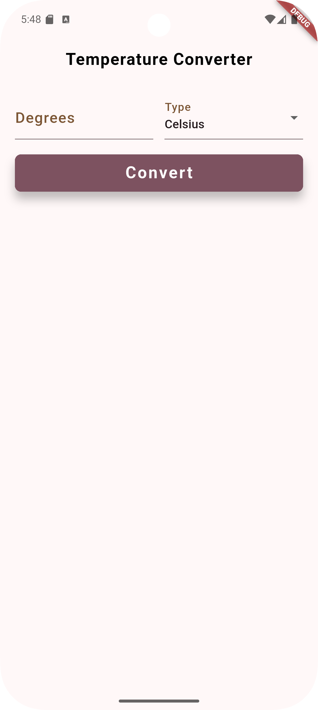
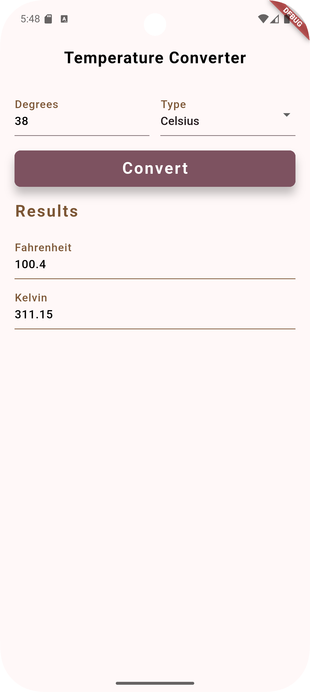

# 📰 DevProjects - Temperature Converter Mobile App

This is an open source project from [DevProjects](http://www.codementor.io/projects). Feedback and questions are welcome!
🔗 Project requirements: [Temperature converter mobile app](https://www.codementor.io/projects/mobile/temperature-converter-mobile-app-atx32h5e71)
---

## 📖 Description
This Flutter application provides a simple and intuitive interface for converting temperatures between Celsius, Kelvin, and Fahrenheit. Users can input a temperature in any of the three units, and the app will instantly calculate and display the corresponding values in the other two units.
---

## 🛠️ Tech Stack
Built with **Flutter** (Dart). 
---

## 🚀 Features
- **Real-time Conversion:** Instantly converts temperatures as the user types.
- **Three Units Supported:** Converts between Celsius, Kelvin, and Fahrenheit.
- **Bi-directional Conversion:** Input in any field updates the other two fields.
    - **Celsius to Kelvin and Fahrenheit**
        - Celsius → Fahrenheit: `F = 1.8 × C + 32`
        - Celsius → Kelvin: `K = C + 273.15`
    - **Kelvin to Celsius and Fahrenheit**
        - Kelvin → Celsius: `C = K - 273.15`
        - Kelvin → Fahrenheit: `F = 1.8 × (K - 273.15) + 32`
    - **Fahrenheit to Celsius and Kelvin**
        - Fahrenheit → Celsius: `C = (F - 32) ÷ 1.8`
        - Fahrenheit → Kelvin: `K = (F + 459.67) ÷ 1.8`
- **User-Friendly Interface:** Clear input fields for each temperature unit, distinguished by color and symbol.
- **Customizable Input Fields:** Utilizes a reusable `TemperatureField` widget for consistent UI.

---

## 📸 Screenshots & Demo




---

## 📂 Project Structure
```
lib/
├── app/
│   ├── data/
│   │   └── temerature_type.dart
│   ├── widgets/
│   │   └── temperature_field.dart
│   └── temperature_converter_page.dart
├── core/
│   └── extensions/
│       └── string.dart
└── main.dart
```
---
## ✅ Requirements Checklist

- [ ] Input field for the user to type in their temperature
    - [ ] Validate that the input is a number
- [ ] Dropdown menu or radio button for the user to choose if they are inputting in Celsius or Fahrenheit
- [ ] "Convert" button to trigger the temperature conversion
- [ ] Display area for the final converted temperature and unit
- [x] Three input fields for the user to type in their temperature
    - [x] Validate that the input is a number
    - [x] Convert the input type to the other two types 
- [x] (Extra) Add a third conversion option to convert from and to Kelvin as well
---

## ⚙️ How It Works
The core logic resides in `temperature_converter_page.dart`. It uses a `TextEditingController` for each temperature unit (Celsius, Kelvin, Fahrenheit). When a user inputs a value in one field:
1. The corresponding `onChanged` callback (`celsiusTemperature`, `kelvinTemperature`, or `fahrenheitTemperature`) is triggered.
2. These methods calculate the other two temperature values using standard conversion formulas.
3. `setState` updates the `TextEditingController.text` values for the other fields.
4. The `TemperatureField` widget is a reusable component that takes:
    - A `TextEditingController`
    - Display properties (title, symbol, color)
    - An `onChanged` callback
---

## ⚙️ Installation & Setup

### Prerequisites
- **Flutter SDK** installed → [Install guide](https://flutter.dev/docs/get-started/install)
- **Dart SDK** (bundled with Flutter)
- **IDE**: Android Studio / VS Code with Flutter plugin

### Steps to Run
1. Clone the repository:
```
   git clone https://github.com/your-username/Temperature-converter-mobile-app/.git
```

2.  **Navigate to the project directory:**
    Change your current directory to the project folder:
```
cd temperature_converter
```    

3.  **Run the application:**
    Use the Flutter command to run the application:

```
flutter pub get
flutter run    
```
---

## 📖 Usage
1. Launch the app
2. The home screen displays three `TextformField` of temperature type "Celsius", "Kelvin", "Fahrenheit".
3. Enter any value in any of the fields to convert it to the other two fields.
---

## 🤝Contributing

### Contributions are welcome! 🎉

1. Fork the repository
2. Create a new branch → `(git checkout -b feature-branch)`
3. Commit changes → `git commit -m "Add feature XYZ"`
4. Push changes → `git push origin feature-branch`
5. Open a Pull Request.

