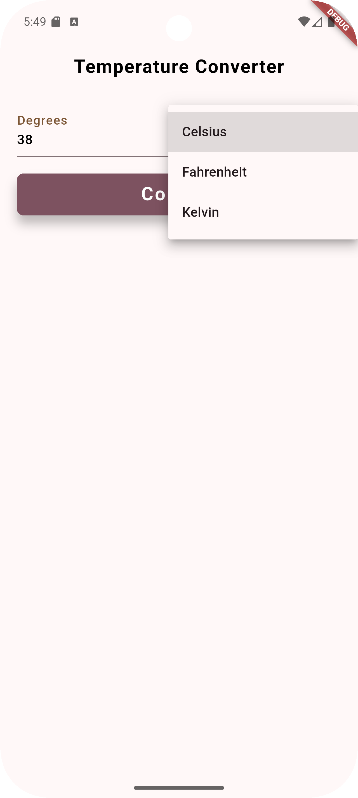

# 📰 DevProjects - Temperature Converter Mobile App

This is an open source project from [DevProjects](http://www.codementor.io/projects). Feedback and questions are welcome!
🔗 Project requirements: [Temperature converter mobile app](https://www.codementor.io/projects/mobile/temperature-converter-mobile-app-atx32h5e71)
---

## 📖 Description
This Flutter application provides a simple and intuitive interface for converting temperatures between Celsius, Kelvin, and Fahrenheit. Users can input a temperature in any of the three units, and the app will instantly calculate and display the corresponding values in the other two units.
---

## 🛠️ Tech Stack
Built with **Flutter** (Dart). 
---

## 🚀 Features
- **Single Input Field:** Users enter the temperature value in one field, ensuring simplicity and reducing confusion.
- **Unit Selection Dropdown:** Users can select the input unit (Celsius, Fahrenheit, or Kelvin) from a dropdown menu.
- **Input Validation:** The app checks that the input is not empty and expects a valid number.
- **Convert Button:** A dedicated button triggers the conversion process based on the selected unit.
- **Automatic Conversion:** When the "Convert" button is pressed, the app calculates and displays the equivalent values in the other two units.
- **Dynamic Result Display:** Only the relevant converted results are shown, depending on the selected input unit.
- **Clear UI Structure:** Results are displayed in read-only fields, and the interface uses clear labels and spacing for usability.
- **State Management:** Uses Flutter’s `setState` and `TextEditingController` to manage input and output fields efficiently.
---

## 📸 Screenshots & Demo





---

## 📂 Project Structure
```
lib/
├── app_theme.dart
├── main.dart
├── result_field.dart
└── temperature_converter_page.dart
```

---
## ✅ Requirements Checklist

- [x] Input field for the user to type in their temperature
    - [x] Validate that the input is a number
- [x] Dropdown menu or radio button for the user to choose if they are inputting in Celsius or Fahrenheit
- [x] "Convert" button to trigger the temperature conversion
- [x] Display area for the final converted temperature and unit
- [ ] Three input fields for the user to type in their temperature
    - [ ] Validate that the input is a number
    - [ ] Convert the input type to the other two types 
- [x] (Extra) Add a third conversion option to convert from and to Kelvin as well
---

## ⚙️ How It Works

The main logic is implemented in `temperature_converter_page.dart` using a stateful widget. Here’s how the temperature conversion flow works:

1. **Input Field:**  
   The user enters a temperature value in the input field. The input is validated to ensure it is a number.

2. **Unit Selection:**  
   The user selects the input unit (Celsius, Fahrenheit, or Kelvin) from a dropdown menu.

3. **Conversion Trigger:**  
   When the "Convert" button is pressed, the app checks the selected unit and uses the appropriate formulas to convert the input value to the other two units.

4. **Result Display:**  
   The converted values are displayed in read-only fields for the other two units. Only the relevant results are shown, depending on the selected input unit.

5. **State Management:**  
   The app uses `TextEditingController` for each unit and updates the controllers’ values using `setState` after conversion.
---

## ⚙️ Installation & Setup

### Prerequisites
- **Flutter SDK** installed → [Install guide](https://flutter.dev/docs/get-started/install)
- **Dart SDK** (bundled with Flutter)
- **IDE**: Android Studio / VS Code with Flutter plugin

### Steps to Run
1. Clone the repository:
```
   git clone https://github.com/your-username/Temperature-converter-mobile-app/.git
```

2.  **Navigate to the project directory:**
    Change your current directory to the project folder:
```
cd temperature_converter
```    

3.  **Run the application:**
    Use the Flutter command to run the application:

```
flutter pub get
flutter run    
```
---

## 📖 Usage
1. Launch the app
2. The home screen displays a degree `TextformField` of temperature type.
3. A `DropDownButton` menu displays "Celsius", "Kelvin", "Fahrenheit".
4. A `Button` to convert the temperature.
5. Two `TextformField` displays the other two temperature value.
---

## 🤝Contributing

### Contributions are welcome! 🎉

1. Fork the repository
2. Create a new branch → `(git checkout -b feature-branch)`
3. Commit changes → `git commit -m "Add feature XYZ"`
4. Push changes → `git push origin feature-branch`
5. Open a Pull Request.

